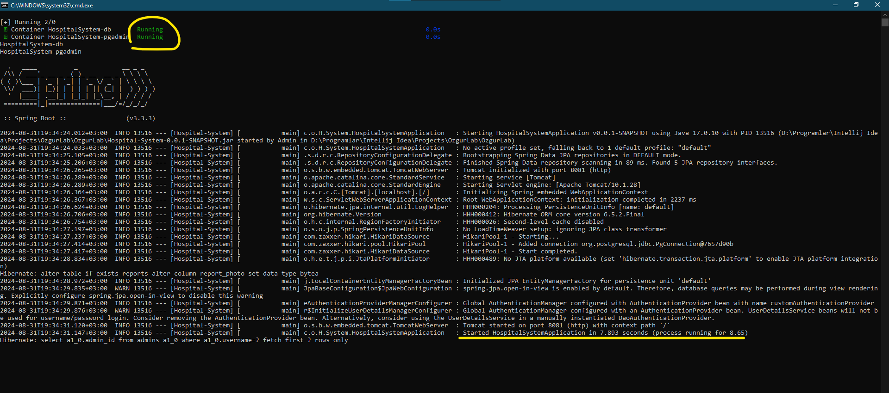
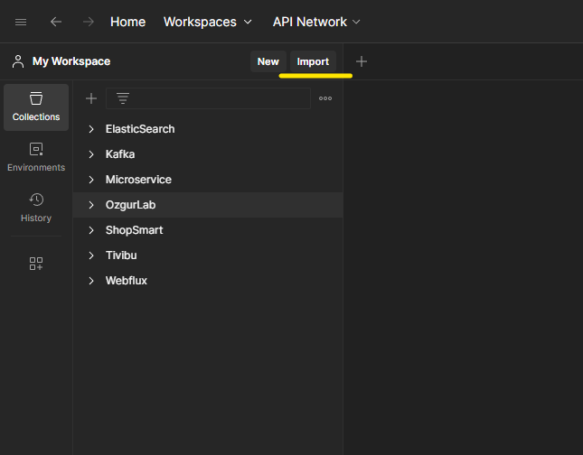
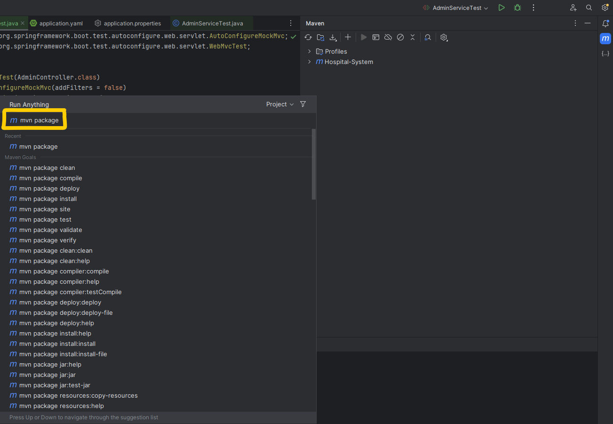

# Ozgur Lab Manual
 
## How to compile and run ? 
> In that project I have used a dockerized database which is PostgreSQL. 
> I provided a "OzgurLab Start.bat" file. That file automatically creates a Docker container in your local and start that, 
> then starts the Spring Boot application.
>
> 
>
>In order to achieve that, the "docker-compose.yaml"  and the jar file should be 
> at the same directory with the "OzgurLab Start.bat" file
>
>
>
>  
>
> 
>Firstly, you have to open your "Docker Desktop" application. Then you need to click double on "OzgurLab Start.bat"
> file. Now the application and database are ready.

 
 
 
 
 

>As you can see firstly the containers are started, then the Spring application is started. Now it is time to use it with
> help of Postman.

 
 
 
 
 

> Open Postman in your PC. Click the "import" button. Then paste that link into there: 
>
> https://api.postman.com/collections/28482635-9da78c82-2c6f-4dd9-ac8b-4de4333e4043?access_key=PMAT-01J6MN88Q4M6VW53T4052JDM5J
>
> Now "OzgurLab" collection should be added to your Postman.

# Endpoints:
>IMPORTANT NOTE BEFORE TESTING ENDPOINTS: 
>  
> There is an embedded "Big Admin" in the lab system. That admin has control on everything and it can not be deleted.
>>username : Big Admin
>>   
>> password : Big Admin
>>  
>> Id : 1

## Laborant Controller: 

### POST : localhost:8081/v1/laborant/createLaborantRequest
> That endpoint gets a "createLaborantRequest" dto object as a JSON body. Then converts that "createLaborantRequest" object to the 
> "LaborantRequest". That "LaborantRequest" is sent to the admin. If admin approve that request, a new laborant 
> is added to the Ozgur Lab. It should has a raw JSON body with "name" ,"surname" and "password" fields.

>In order to reach that endpoint, you must be authenticated.

> After the authentication, authorization system comes into. You need to have "Laborant" or "Admin" role to pass authorization. 

 
 

#### GET :  localhost:8081/v1/laborant/allLaborants

> That endpoint returns all of the laborants in the system. 

>You must be authenticated.

>You must be authorized and have "Laborant" or "Admin" roles to reach that endpoint.

 
 

### PUT  :  localhost:8081/v1/laborant/updateReport
>That request should contain a "form-data" body. In this body there are fields which are: 
> "sickness", "sicknessDetails", "laborantId", "patientTC", "file", "Id", "reportDate". 

>Id column must be filled. Because that is the Id of report which you want to update. All other fields are 
> optional. You can fill the column which you want to update.

>"reportDate" is in LocalDate format. For example:  2024-08-29
 
>"file" field should contain a jpg or png.
 
>You must be authenticated and have "Laborant" role to reach that endpoint.

 
 
 

## Admin Controller: 

### GET  :  localhost:8081/v1/admin/laborantRequests
> That request returns a list of "LaborantRequest". Each "LaborantRequest" has a 7 digit unique Id. Admin takes the id of
> the request which he/she wants to approve. Then use that Id in "approveLaborantRequest" endpoint

>You must be authenticated and have "Admin" role to reach that endpoint. 

 
 
 

### POST  :  localhost:8081/v1/admin/approveLaborantRequest/{id}
>Admins use the Id which they get from "laborantRequests" endpoint in that request. The Id is a path variable,
> so you need to add the Id to the endpoint. If there is a "LaborantRequest" with that Id, that request is converted to 
> a "Laborant". 

>You must be authenticated and have "Admin" role to reach that endpoint.

 
 
 

### POST  :  localhost:8081/v1/admin/createAdmin
>That endpoint has a raw JSON body which has "name",  "surname",  "password",  "username" fields. It checks whether the 
> the fields are null or not. All fields should be filled.  Then it checks whether the username in the JSON is unique or not.
> If it passes all of the checks, a new admin is created with a 7 digit unique Id.

>You must be authenticated and have "Admin" role to reach that endpoint.

 
 
 

### PUT   :   localhost:8081/v1/admin/updateOwnAdminAccount
>That endpoint has a raw JSON body which has "name",  "surname",  "password",  "username" fields. With that endpoint,
> admins can update just their current authenticated accounts. So that endpoint does not want an Id information. All the 
> fields in JSON can be null, it is developed resilient. You can update either one or all fields.

>You must be authenticated and have "Admin" role to reach that endpoint.

 
 
 

### GET   :   localhost:8081/v1/admin/getAllAdmins
>That endpoint returns a list of admins.

>You must be authenticated and have "Admin" role to reach that endpoint.

 
 
 

### DELETE   :   localhost:8081/v1/admin/deleteAdminById/{id}
>That endpoint takes an admin Id as path variable in the endpoint. It checks you are "Big Admin" or you are the admin with the given 
> id as parameter. So admins only delete their own accounts. Just "Big Admin" can delete all the admin accounts.

>You must be authenticated and have "Admin" role to delete your own account. But if you are authenticated as "Big Admin"
> you can delete all admins.

 
 
 

### DELETE   :   localhost:8081/v1/admin/deleteAdminByUsername/{username}
>That endpoint takes an admin username as path variable in the endpoint. It checks you are "Big Admin" or you are the admin with the given
> username as parameter. So admins only delete their own accounts. Just "Big Admin" can delete all the admin accounts.

>You must be authenticated and have "Admin" role to delete your own account. But if you are authenticated as "Big Admin"
> you can delete all admins.

 
 
 

### GET   :   localhost:8081/v1/admin/getAllPatients
>That endpoint returns a list of patients.

>You must be authenticated and have "Admin" role to reach that endpoint.

 
 
 

### GET   :   localhost:8081/v1/admin/getPatientByName/{name}
>That endpoint takes a patient name as path variable. It returns that patient if he/she exists.

>You must be authenticated and have "Admin" role to reach that endpoint.

 
 
 
 

## Patient Controller:

### POST   :   localhost:8081/v1/patient/createPatient
>That endpoint takes a raw JSON body. That body must contain field "name",  "username",  "password",  "TC". 
> The system checks whether the name, username and the TC fields are unique or not. If they are all unique it creates a patient.

>You don't have to be authenticated to reach that endpoint. 

 
 
 

### GET   :   localhost:8081/v1/patient/getReports
>That endpoint returns all reports of the authenticated user as JSON format.

>You must be authenticated and have "User" role to reach that endpoint. 

 
 
 

### GET   :   localhost:8081/v1/patient/getReportsSortedByDate
>That endpoint returns all reports of the authenticated user as sorted by date. 

>You must be authenticated and have "User" role to reach that endpoint. 

 
 
 
 

## Report Controller:

### POST  :   localhost:8081/v1/report/createReport
>That request should contain a "form-data" body. In this body there are fields which are:
> "sickness", "sicknessDetails", "laborantId", "patientTC", "file", "reportDate".

>All the columns must be filled.

>"reportDate" is in LocalDate format. For example:  2024-08-29

>"file" field should contain a jpg or png.

>You must be authenticated and have "Laborant" role to reach that endpoint.

 
 
 

### GET   :   localhost:8081/v1/report/getAllReports
>That endpoint returns a list of reports.

>You must be authenticated and have "Laborant" role to reach that endpoint.

 
 
 

### GET   :   localhost:8081/v1/report/getAllReportsSortedByDate
>That endpoint returns a list of report which are sorted by date.

>You must be authenticated and have "Laborant" role to reach that endpoint.

 
 
 

### GET   :   localhost:8081/v1/report/getReportPhoto/{id}
>That endpoint returns a base64 encoded byte array which contains photo of the report. It takes Id of the report as path
> variable in the endpoint.

>You must be authenticated and have "Laborant" role to reach that endpoint.
#
#
## How to convert the source code into executable Jar file :
>By entering the commandline of the maven in our IDE we can run our maven commands. With running "mvn package" command
> the source codes can be converted to executable Jar file.

## How to close the application ? 
> You just need to close the cmd file which the Jar file is running on. Then you need to double click on "OzgurLab Stop Database.bat" file.
> That is going to close the docker containers and that is all. 

 
